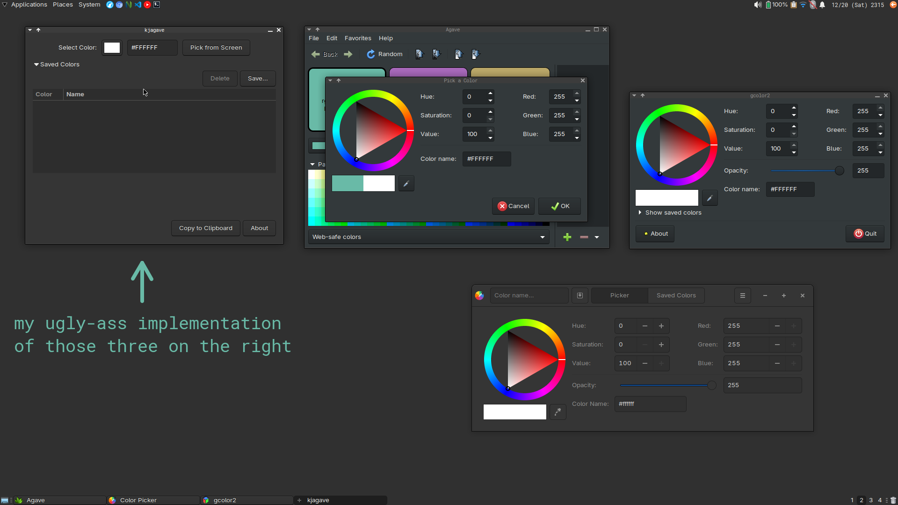

# kjagave 

a color picker inspired by agave, but only with the features I actually used



## features

- visual color picker with rgb/hsv sliders
- **pick colors from anywhere on screen (only on x11 because I'm lazy)**
- alpha channel support
- save and manage favorite colors
- copy hex color codes to clipboard
- clean, minimal interface

## requirements

- go 1.21 or higher
- gtk3 development libraries
- `xcolor` or `grabc` for screen color picking

## building

```sh
cd src
go mod download
go build -o ./kjagave main.go
```

## running

from the src/ directory:

```bash
./kjagave
```

## usage

1. use the color picker button to open the full color selection dialog
2. **click "Pick from Screen" to grab a color from anywhere on your screen** - your cursor will change to a crosshair, click on any pixel to select its color
3. click "Copy to Clipboard" to copy the hex color code
4. click "Save..." to save the current color to your favorites list
5. expand "Saved Colors" to view and manage your saved colors
6. select a saved color to load it in the picker
7. click "Delete" to remove a selected saved color

saved colors are stored in `~/.config/kjagave.json` as json.